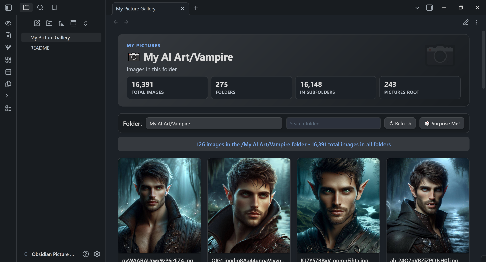
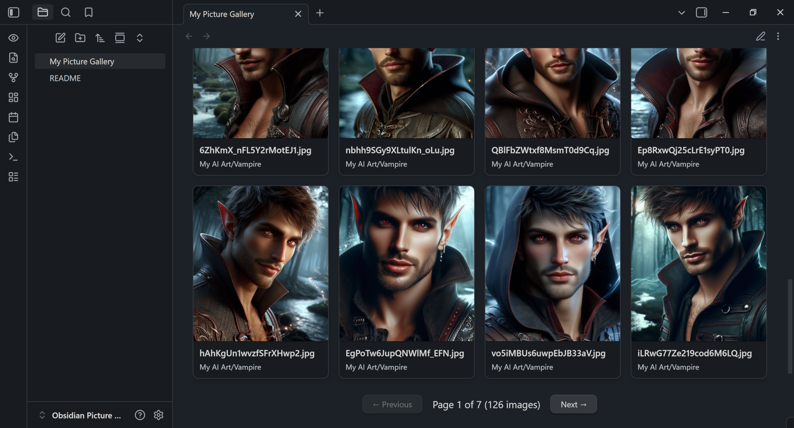
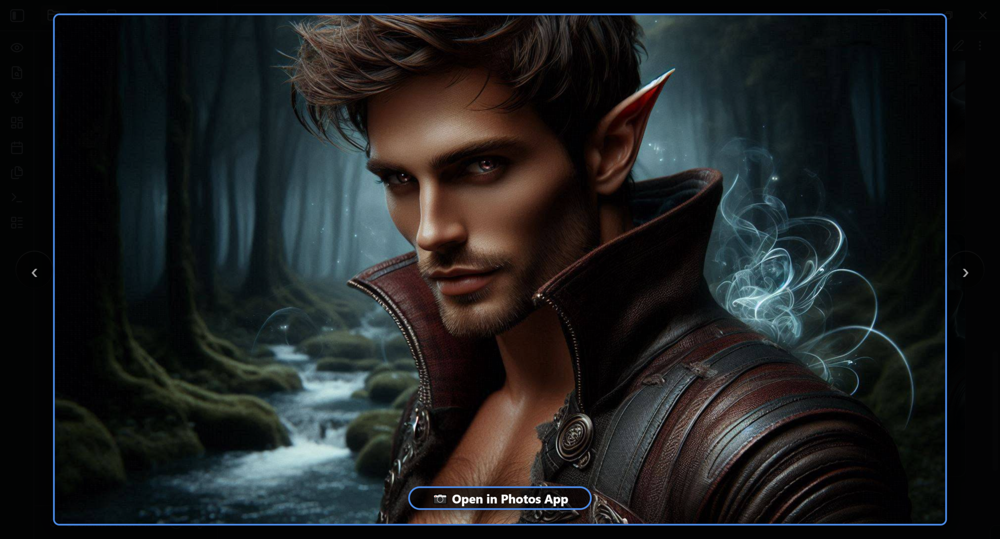
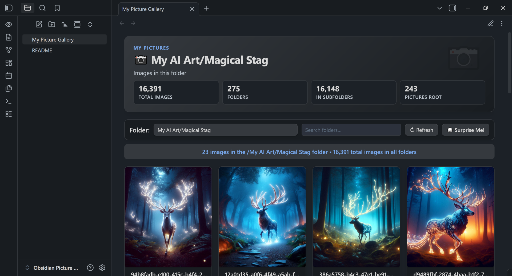
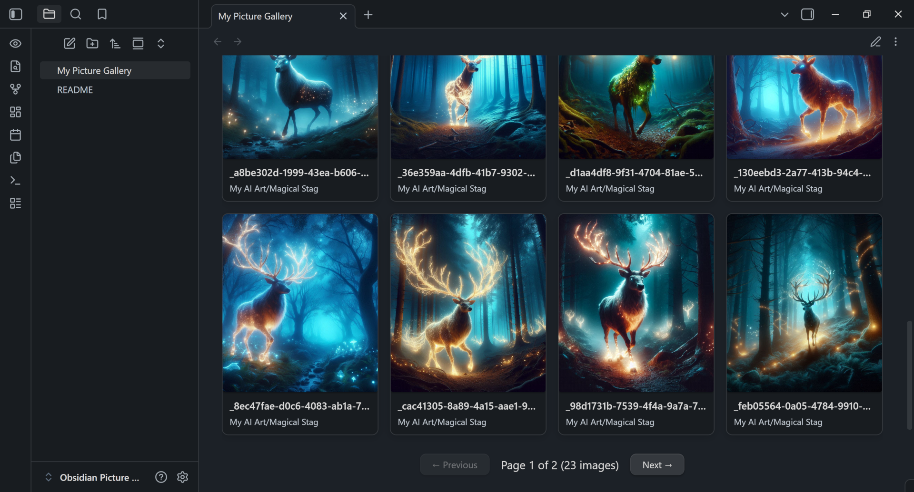
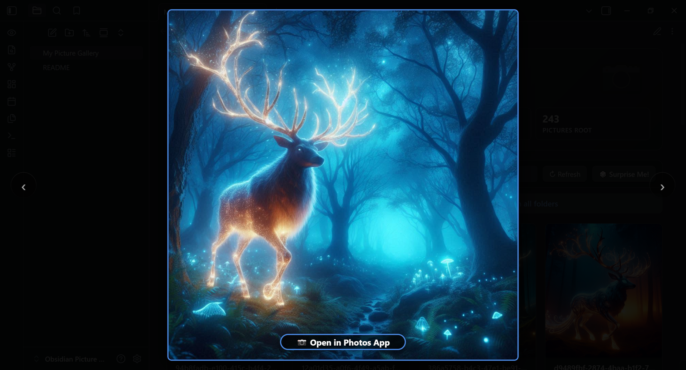

## 📷 **Obsidian Picture Gallery**

<p align="center">
  <a href="https://github.com/GathusHQ/obsidian-picture-gallery/releases"></a>
  <a href="https://github.com/GathusHQ/obsidian-picture-gallery/releases"></a>
</p>

A clean, simple dashboard interface for your local Pictures folder

👉 **Download the latest version (ZIP)**  
https://github.com/GathusHQ/obsidian-picture-gallery/releases

### ✨ Features
- Information sections showing counts for Total Images, Folders, Subfolders and Pictures Root
- Navigation bar that includes folder selection, folder search, a refresh button, and a **Surprise Me** button that picks a random image from the currently selected folder or from the current folder search results.
- Lightbox with Open In Photos app button.
- Full pagination for browsing large image collections.
- Easy-to-adjust settings for your Pictures root, images per page, and images per column.
- Theme-aware coloring throughout.

---

### 📁 Folder Structure

The download contains the following files and folders:

```
├── My Picture Gallery.md   ← Main dashboard
├── README.md
└── .obsidian/
    └── plugins/
        └── external-image-loader/   ← Allows the gallery to access images outside of Obsidian
            ├── main.js
            ├── manifest.json
            └── styles.css
```

Copy these files and folders into the **root** of your Obsidian vault, preserving the folder structure shown above.

---

### 🎨 Theme and Appearance Settings to Match the Screenshots

These settings are optional, but they will make your vault look more like the screenshots shown in this guide. They don't affect the gallery's functionality—only its appearance and layout.

### Theme

The screenshots use the **Things** theme with the following style preset:
**Things — _Dark Mode_**

The gallery works with any Obsidian theme; Things is simply the theme used for the screenshots.

### Appearance Settings

These settings affect layout, spacing, and how clean the pages look:

- Appearance → Inline title → **Off**
- Editor → Readable line length → **Off**
- Editor → Properties in document → **Hidden**
- Core plugins → Page preview → **Off**

### Editor Behavior

These settings match the environment used to create the screenshots:

- Editor → Default view for new tabs → **Reading view**
- Editor → Default editing mode → **Source mode**

---

## Screenshots
Some examples of the Gallery in use with a fantasy artwork collection.

### Gallery in Action
#### Vampires




#### Magical Stags




---

### 🚀 Installation (2 minutes)

Getting started is simple:

1. Unzip the download.
2. Copy the unzipped files and folders into the root of your Obsidian vault, preserving the file and folder structure shown above.
3. Enable the included **External Image Loader** plugin:
    - Settings → Community plugins → **Installed plugins**
    - Find **External Image Loader** and enable it.
4. Make sure **Dataview** is installed and enabled:
    - Settings → Community plugins → Browse → **Dataview**
    - Enable **Dataview**
    - In Dataview settings, turn on **Enable JavaScript Queries**
5. Open **My Picture Gallery.md** in Edit mode and change the path to your **Pictures** folder.
    - **Example:** `PICTURES_ROOT = "C:/Users/YourNameHere/Pictures";`

**That's it!** No setup wizard, and no additional configuration.

---

### 🔌 Required Plugins

The Gallery uses two small pieces of functionality:

- **Dataview** (required) — powers the gallery's image browsing and folder information.
- **External Image Loader** (included) — allows the gallery to display images stored outside of your Obsidian vault.

The External Image Loader plugin is included directly with the Gallery, so you don't need to download it from somewhere else.

> #### 🔍 Want to see what it does?
The **External Image Loader** plugin is intentionally small, and its source files are included with the Gallery download.
If you'd like to take a look before enabling it, simply unzip the download and open **main.js** or **manifest.json** in any text editor. You can see exactly what the plugin contains without needing any special software.
The same files are also available directly in this repository for anyone who wants to review them before downloading.

---

### 🖼️ Using the Gallery

Open **My Picture Gallery.md** and start browsing.

- Use the **folder selector** to browse a specific folder.
- Use **search** to quickly find folders or images.
- Use **Surprise Me** when you want to let the gallery pick an image for you.
- Use the **pagination controls** to move through larger collections.

Want to customize the gallery? Switch the dashboard to Edit mode and adjust the settings at the top of the page.

The gallery automatically updates as you add, remove, or organize images in your Pictures folder.

---

### 🎉 Enjoy!

That's really all there is to it.

The Obsidian Picture Gallery was built to make browsing a large collection of local images feel simple, clean, and a little more enjoyable.

Drop it into your vault, point it at your Pictures folder, and start browsing. 🖼️
